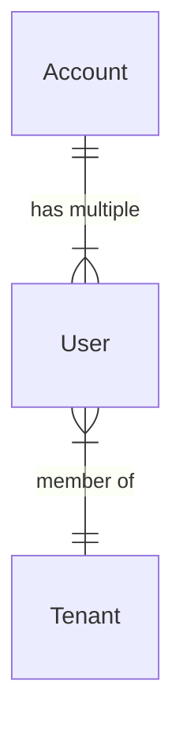

# Account
Ein Account besitzt eine [[Ids#Extern|externe Id ]]und ein Password welche auf eine [[Ids#Intern|interne Id]] mappen
Ein Account kann mehrere [[#User]] verwalten
# Tenant
Ein Tenant besitzt eine [[Ids#Intern|TenantId]] 
Ein Tenant hat mehrere [[#User]] und [[#Gruppen]]
# User
Durch eine [[Ids#Intern|interne Id]] und [[Ids#Intern|TenantId]] auf eine [[Ids#Intern|UserId]] gemapped
Jeder [[#Account]] kann einen User pro [[#Tenant]] haben
# Gruppen
Es soll vorerst keine Gruppen für das User Management geben. Die Anzahl der zu verwaltenden Mitarbeiten ist sehr gering. Sollten später Gruppen eingeführt werden macht eine Zusammenlegung mit den Usern in einen Service sinn.
# Übersicht
